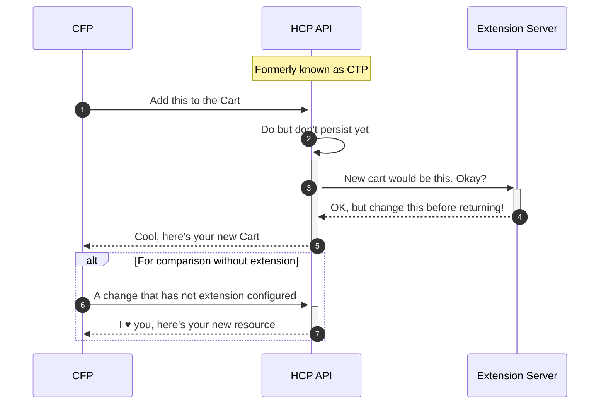
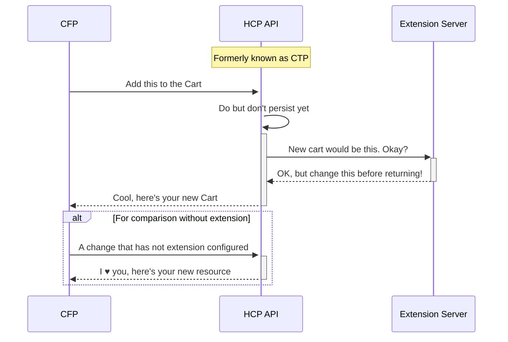
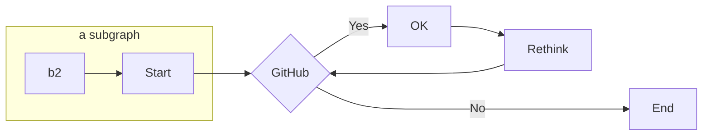
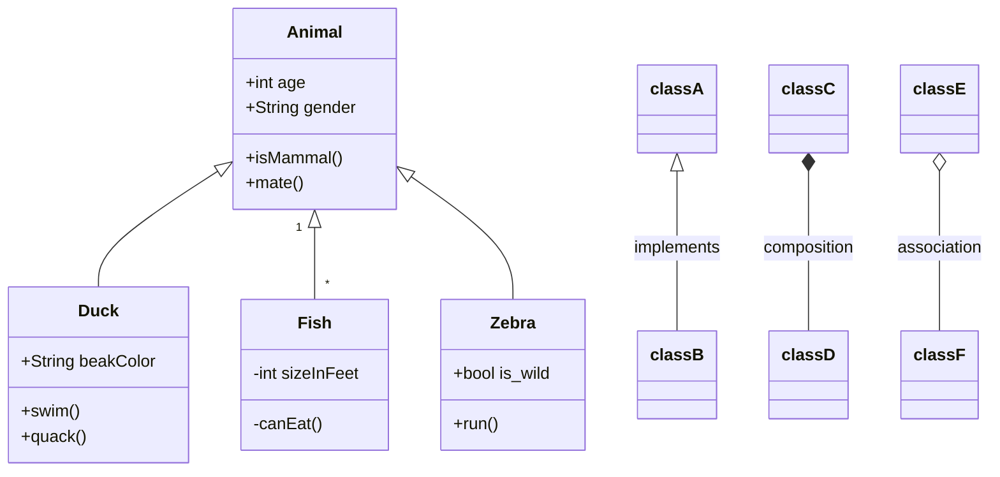
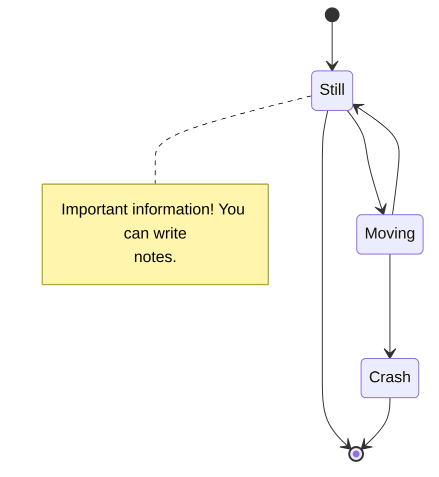

# A Sequence Diagram

## With automatic numbering

```mermaid
sequenceDiagram
  autonumber
  participant CFP
  participant HCP API
  participant Extension Server
  Note over HCP API: Formerly known as CTP
  CFP->>+HCP API: Add this to the Cart
  HCP API->>+HCP API: Do but don't persist yet
  HCP API->>+Extension Server: New cart would be this. Okay?
  Extension Server-->>-HCP API: OK, but change this before returning!
  HCP API-->>-CFP: Cool, here's your new Cart
  alt For comparison without extension
  CFP->>+HCP API: A change that has not extension configured
  HCP API-->>-CFP: I #9829; you, here's your new resource
  end
```

## Without automatic numbering

```mermaid
sequenceDiagram
  participant CFP
  participant HCP API
  participant Extension Server
  Note over HCP API: Formerly known as CTP
  CFP->>+HCP API: Add this to the Cart
  HCP API->>+HCP API: Do but don't persist yet
  HCP API->>+Extension Server: New cart would be this. Okay?
  Extension Server-->>-HCP API: OK, but change this before returning!
  HCP API-->>-CFP: Cool, here's your new Cart
  alt For comparison without extension
  CFP->>+HCP API: A change that has not extension configured
  HCP API-->>-CFP: I #9829; you, here's your new resource
  end
```

# A Flow Chart

```mermaid
flowchart LR
    subgraph a subgraph
    b2-->A
    end
    A[Start] --> GitHub{GitHub}
    GitHub -->|Yes| C[OK]
    C --> D[Rethink]
    D --> GitHub
    GitHub ---->|No| E[End]
    click GitHub "http://www.github.com" "B is a link to Github"
```

# A Class Diagram

```mermaid
 classDiagram
  Animal <|-- Duck
  Animal "1" <|-- "*" Fish
  Animal <|-- Zebra
  Animal : +int age
  Animal : +String gender
  Animal: +isMammal()
  Animal: +mate()
  class Duck{
      +String beakColor
      +swim()
      +quack()
  }
  class Fish{
      -int sizeInFeet
      -canEat()
  }
  class Zebra{
      +bool is_wild
      +run()
  }
  classA <|-- classB : implements
  classC *-- classD : composition
  classE o-- classF : association
```

# State Diagram

```mermaid
stateDiagram-v2
    [*] --> Still
    Still --> [*]
    note right of Still
      Important information! You can write
      notes.
    end note
    Still --> Moving
    Moving --> Still
    Moving --> Crash
    Crash --> [*]
```
