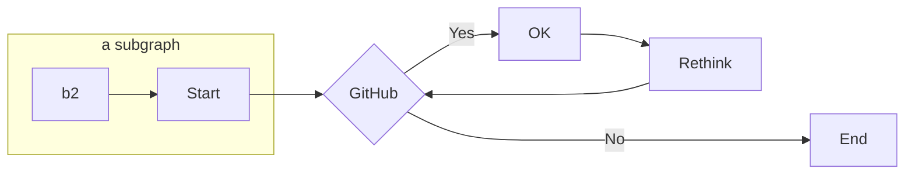

import { LoginButton, IfUserLoggedOut, FirstName } from '@commercetools-docs/gatsby-theme-docs'


<MultiPathBlock>
<PathBlock label="Javascript path" syncWith="javascript">

**Markdown content**
<br/>

**Bold text**
*Italic text*
***Bold and Italic text***
~~Strikethrough text~~
<br/>

> This is a blockquote. Lorem ipsum dolor sit amet, consectetur adipiscing elit. Integer nec odio. Praesent libero. Sed cursus ante dapibus diam.
<br/>

1. First ordered list item
2. Second item
   - Unordered sub-list.
3. Third item

<br/>

- Bullet list item
- Another item
  - Sub-list item
  - Another sub-list item

<br/>

`Inline code example`

```python
# Code block example
def hello_world():
    print("Hello, World!")
```

Table | Column B | Column C
---------|----------|---------
 A1 | B1 | C1
 A2 | B2 | C2
 A3 | B3 | C3

<br/>

**`<CodeExample>` component**
<CodeExample path="example.js" title="JavaScript Code Sample" />

<br/>

</PathBlock>
<PathBlock label="PHP path" syncWith="php">

**Custom components**

<br/>

**Content Notifications**

<Info>

(Default) The configuration can be fixed for example by re-creating the configuration on the destination side, or by setting a new configuration with the update action Change Destination.

</Info>

<br/>

<Warning>

(Warning) Please note that the health of our delivery infrastructure is independent of the `SubscriptionHealthStatus` and can be checked on our [status page](https://www.google.com) (it is part of the `Background Services`).


</Warning>

<br/>

<Error>

(Error) Please note that the health of our delivery infrastructure is independent of the `SubscriptionHealthStatus` and can be checked on our [status page](https://www.google.com) (it is part of the `Background Services`).

</Error>

<br/>

**BETA tag and PlanTag**

Some text availabe only in <Beta />.

Some custom plan tags: <PlanTag plan="plan1" />, <PlanTag plan="plan2" />.

<br />

**Cards component**

<Cards narrow>
  <Card>

  [Documentation](/../documentation)

  </Card>
  <Card>

  [Docs kit smoke test](/../docs-smoke-test)

  </Card>
  <Card>

  [Site Template](/../site-template)

  </Card>
</Cards>

<br />

**More Cards component**

<Cards clickable narrow smallTitle fitContentColumn>
  <Card>foo</Card>
  <Card>bar</Card>
  <Card>next row unless three aside (narrow) prop passed?</Card>
  <Card>next row in any case</Card>
</Cards>
</PathBlock>
<PathBlock label="others">

** More custom components **

<br/>

**Mermaid Diagram**



<br/>

**Video Player**
<Video
  url="https://customer-ytbpo1yna9xohg5m.cloudflarestream.com/33709d50562534d2a6f9f2b1766d8ff6/manifest/video.m3u8"
  poster="https://customer-ytbpo1yna9xohg5m.cloudflarestream.com/33709d50562534d2a6f9f2b1766d8ff6/thumbnails/thumbnail.jpg?time=10s"
/>

<br />

**Self learning conditionals**

<IfUserLoggedIn>

Logged in, <FirstName />

</IfUserLoggedIn>
<IfUserLoggedOut>

Please log in

</IfUserLoggedOut>
</PathBlock>
</MultiPathBlock>
