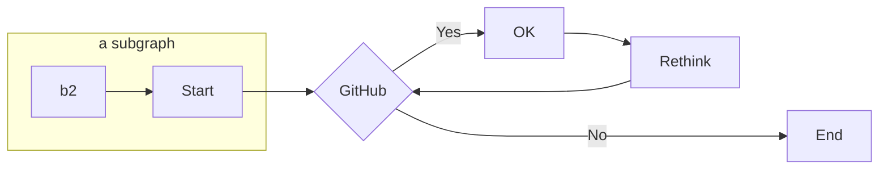

# Manual Side By Side Content

<SideBySide>

The `<SideBySide>` component allows wrapping two arbitrary pieces of markdown or MDX block-level
contents to allow the wide layout to put the next to each other if the space allows. It's for "Pairs" of
content that directly belong to each other. If multiple blocks are intended for this "left" part it needs to be wrapped
in a `<div>` which is not nice but at least works.

```md
<SideBySide>

Block one - don't forget the blank lines!

Blick two - don't forget the blank lines!

</SideBySide>
```

</SideBySide>


# Multi Path Block example

<MultiPathBlock>
<PathBlock label="Side by side test" >

<SideBySide>



<Video
  url="https://customer-ytbpo1yna9xohg5m.cloudflarestream.com/33709d50562534d2a6f9f2b1766d8ff6/manifest/video.m3u8"
  poster="https://customer-ytbpo1yna9xohg5m.cloudflarestream.com/33709d50562534d2a6f9f2b1766d8ff6/thumbnails/thumbnail.jpg?time=10s"
/>

</SideBySide>

</PathBlock>

<PathBlock label="Wide layout standard content" >


<br />

<Video
  url="https://customer-ytbpo1yna9xohg5m.cloudflarestream.com/33709d50562534d2a6f9f2b1766d8ff6/manifest/video.m3u8"
  poster="https://customer-ytbpo1yna9xohg5m.cloudflarestream.com/33709d50562534d2a6f9f2b1766d8ff6/thumbnails/thumbnail.jpg?time=10s"
/>

</PathBlock>

</MultiPathBlock>
