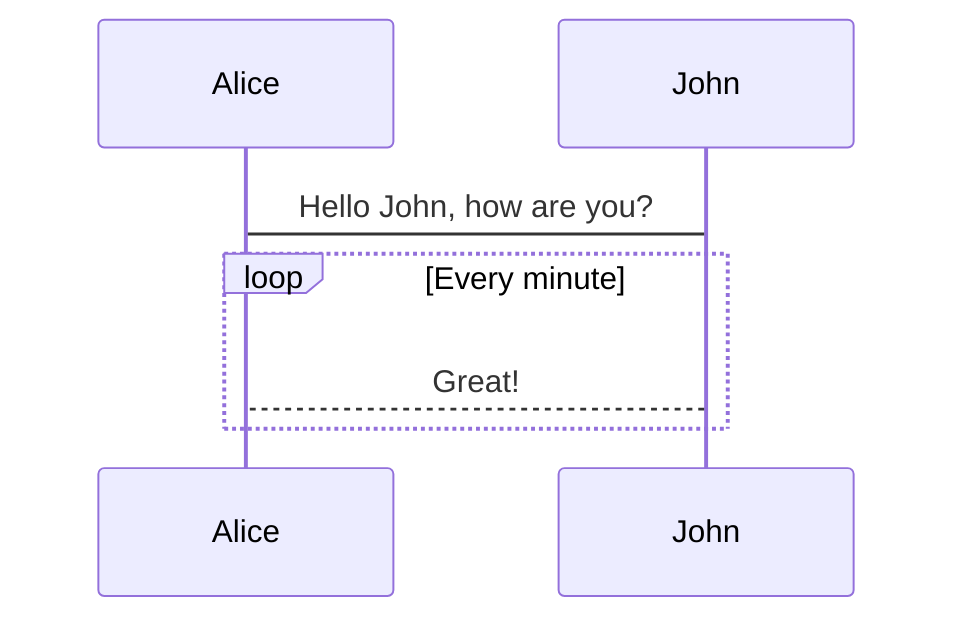

# Images

All image files must be placed in `/src/images` in full original resolution and quality. Multiple compressed and lower resolution files are generated automatically when building the website.

You use [standard markdown syntax](https://commonmark.org/help/tutorial/08-images.html) to insert images into content pages.

It is good to have a meaningful alt text when using images. A meaningful alt text is useful for visually impaired users using softwares to read text on a page.

- You can add a caption to images by following the Markdown syntax for titles.
- Images with a transparent background (PNG) are rendered on white background. It's OK to leave transparent background
- SVG images are not optimized or scaled, but would still be rendered. They need to be placed into `/src/files/` for unprocessed delivery.

<SideBySide>

```md title="you write:" secondaryTheme
Full example with alt text title:


Full SVG example:


```

<Card>

</Card>

</SideBySide>

Unless not otherwise possible, avoid:

- images on external servers (not optimized, can disappear)
- images of small sizes or large heights

# Mermaid Diagrams

It's possible to create diagrams using [mermaid syntax](https://mermaid-js.github.io/mermaid/#/) directly in the MDX files. For example, it's possible to create sequence diagrams, flowcharts, class diagrams, ER diagrams, state diagrams and others.

To author, either use [mermaid.live](https://mermaid.live) or install the mermaid VSCode plugin to get syntax support while writing.

Avoid custom CSS or theme overrides for better maintainability of the content.

<SideBySide>

````md title="you write:" secondaryTheme

````

<Card>

</Card>

</SideBySide>
