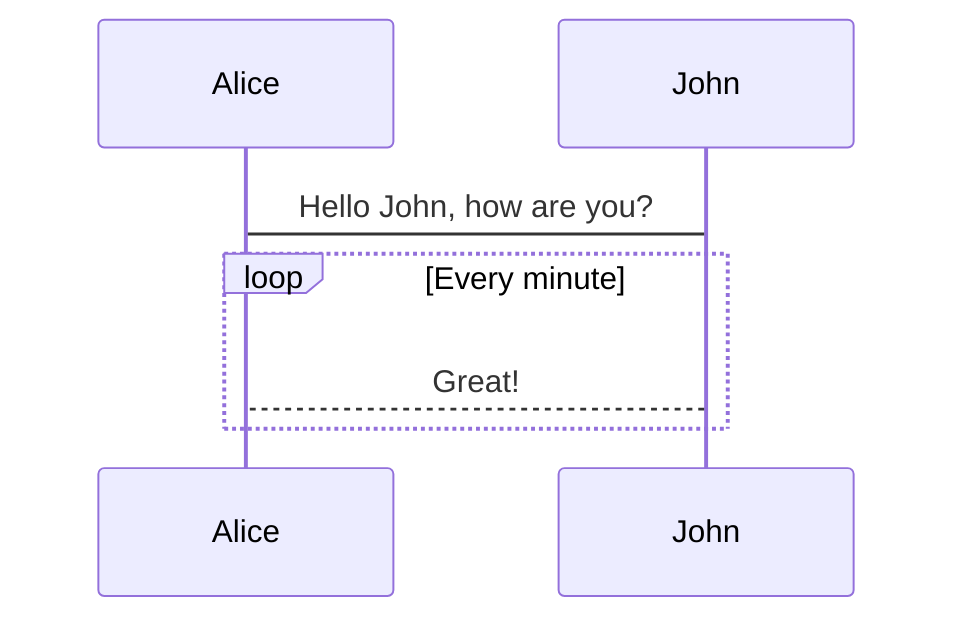
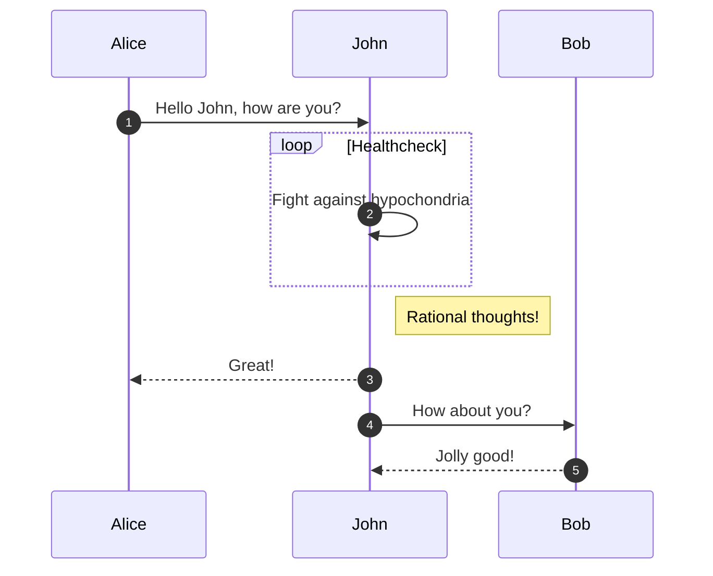

# Images

All image files must be placed in `/src/images` in full original resolution and quality. Multiple compressed and lower resolution files are generated automatically when building the website.

You use [standard markdown syntax](https://commonmark.org/help/tutorial/08-images.html) to insert images into content pages.

It is good to have a meaningful alt text when using images. A meaningful alt text is useful for visually impaired users using softwares to read text on a page.

- You can add a caption to images by following the Markdown syntax for titles.
- Images with a transparent background (PNG) are rendered on white background. It's OK to leave transparent background
- SVG images are not optimized or scaled, but would still be rendered. They need to be placed into `/src/files/` for unprocessed delivery.

<SideBySide>


```md title="you write:" secondaryTheme
Full example with alt text title:


Full SVG example:


```

</SideBySide>

Unless not otherwise possible, avoid:

- images on external servers (not optimized, can disappear)
- images of small sizes or large heights

# Mermaid Diagrams

It's possible to create diagrams using [mermaid syntax](https://mermaid-js.github.io/mermaid/#/) directly in the MDX files. For example, it's possible to create sequence diagrams, flowcharts, class diagrams, ER diagrams, state diagrams and others.

To author, either use [mermaid.live](https://mermaid.live) or install the mermaid VSCode plugin to get syntax support while writing.

Avoid custom CSS or theme overrides for better maintainability of the content.

````md title="you write:" secondaryTheme

````


If you want to show the sequence number attached to each arrow in a sequence diagram, you need to add the `autonumber` variable.

````md title="you write:" secondaryTheme

````


# Videos

It's possible to embed a video in a page by using `Video` component.

The component accepts the following properties:

- `url` (mandatory): The source URL to a video source to embed.
- `poster`: an optional parameter specifying a URL to an image that displays before the video begins playing. This is often a frame of the video or a custom title screen. As soon as the user hits "play" the image will go away. If not specified, the initial frame of the video will be displayed instead.

<SideBySide>
  <Video
      url="https://customer-ytbpo1yna9xohg5m.cloudflarestream.com/e1aa2e24614b242afdd4afb36a0c2f75/manifest/video.m3u8"
      poster="https://customer-ytbpo1yna9xohg5m.cloudflarestream.com/e1aa2e24614b242afdd4afb36a0c2f75/thumbnails/thumbnail.jpg?time=6s"
    ></Video>

```md title="you write:" secondaryTheme
<Video
  url="https://customer-ytbpo1yna9xohg5m.cloudflarestream.com/e1aa2e24614b242afdd4afb36a0c2f75/manifest/video.m3u8"
  poster="https://customer-ytbpo1yna9xohg5m.cloudflarestream.com/e1aa2e24614b242afdd4afb36a0c2f75/thumbnails/thumbnail.jpg?time=6s"
/>
```

</SideBySide>
